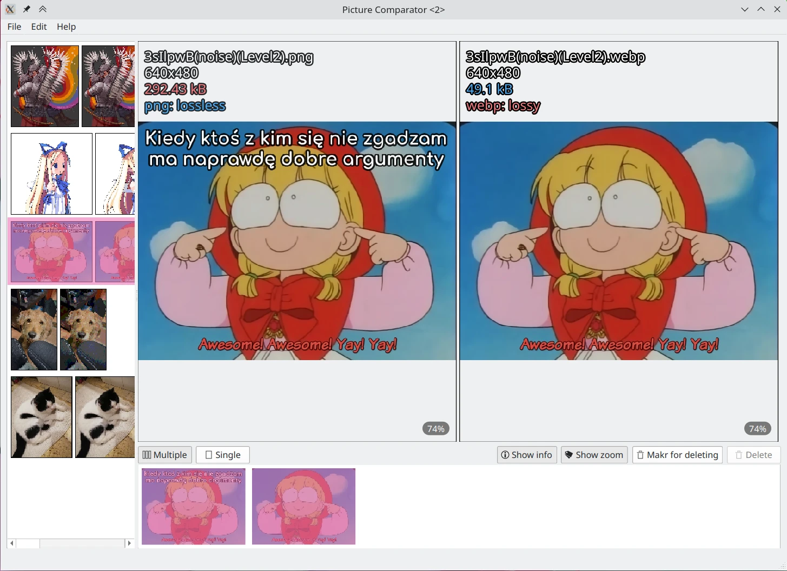
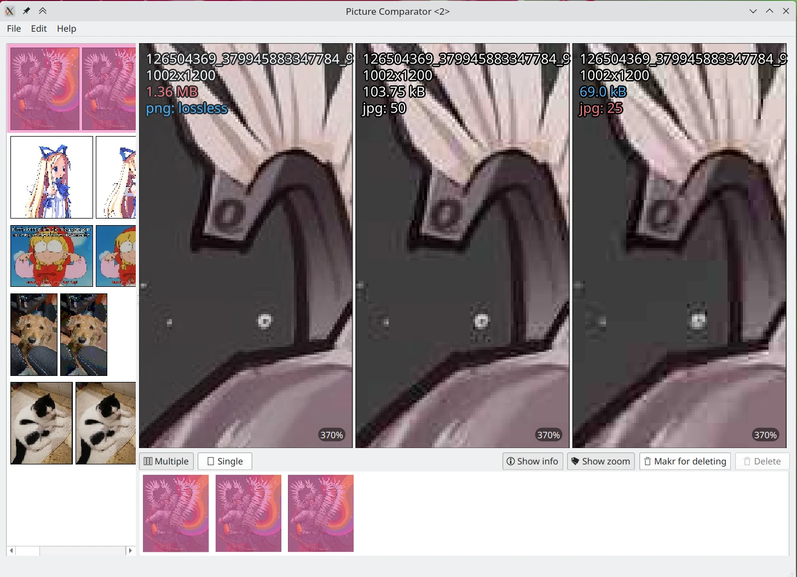
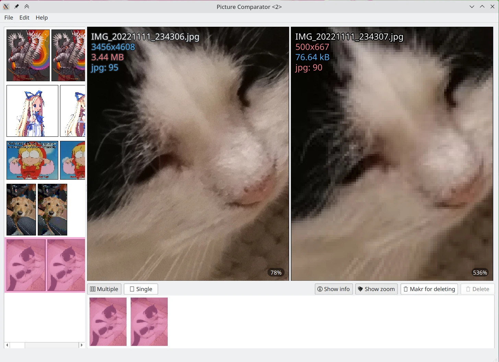
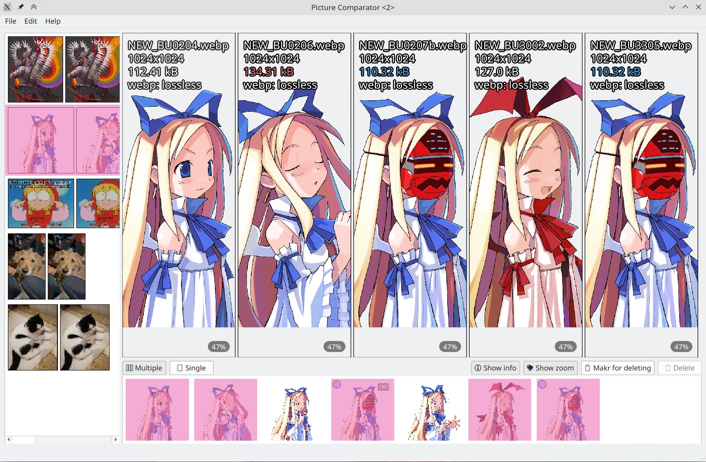

# picture-comparator

## Overview

Application looks for similar images in given directories. It allows to view results, make them easy to compare, move marked images to trash or rename them.

## Installation

```
pip install picture-comparator-muri
```

## Basic usage

After picking directories to search (either with GUI picker or `-d <list of directories>`) and waiting for a while, we should see list of results. Here, we have few tools helping us to compare them.

On the top of each image, we can see some of its properties. The "_best_" and "_worst_" ones should be marked in colors.  
We can zoom and move image using mouse. Position of all images will be in sync.

When comparing images with different sizes, the application will scale them.

Identical images are marked using little circles. This checks actual pixels, not file hash, so images with different compression levels or extensions can still be marked as identical.  
Symbolic links are also marked with an icon.

Clicking on "Mark for deleting" or holding down [Ctrl] key enables deleting mode. Selecting "delete" or clicking [del] moves files marked for deletion into trash.  
Selecting Edit -> Rename or clicking [F2] shows dialog for renaming and moving files.

## Known problems

The application is still in early development. Some known problems include.

- Very slow page change.
- Trouble when parsing many huge images.
- Comparison algorithm showing many false positives.
- Very limited configuration. 
- No option to start new search (need to restart application).
- Zoom being shown regardless if zoom button is pressed.
- Zooming being overly simple and broken.
